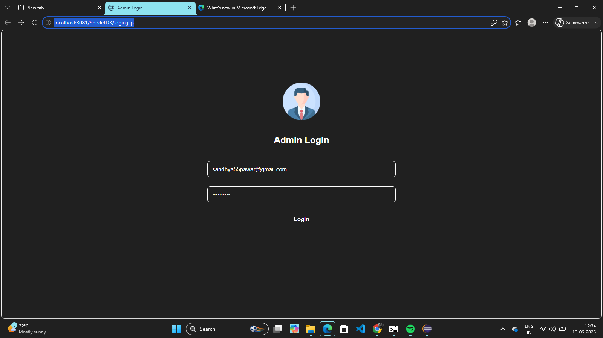
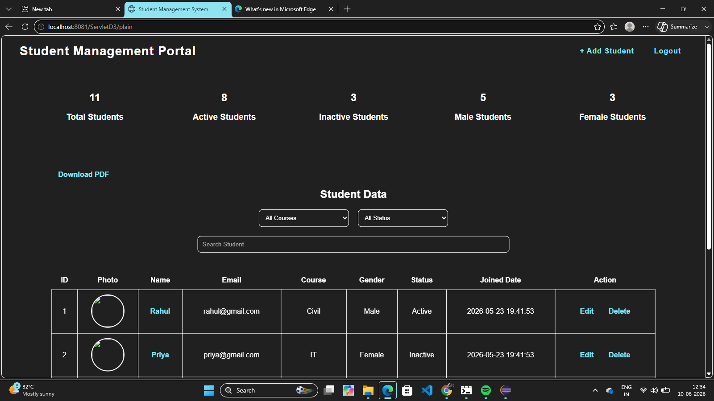
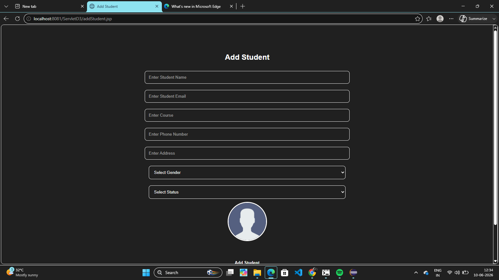
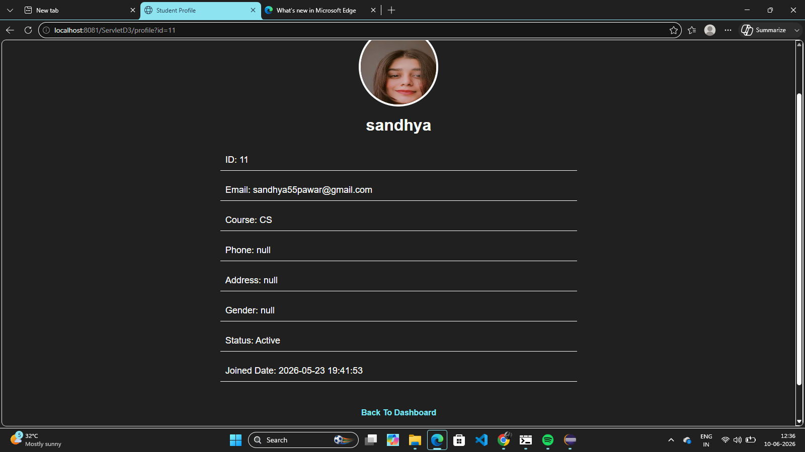
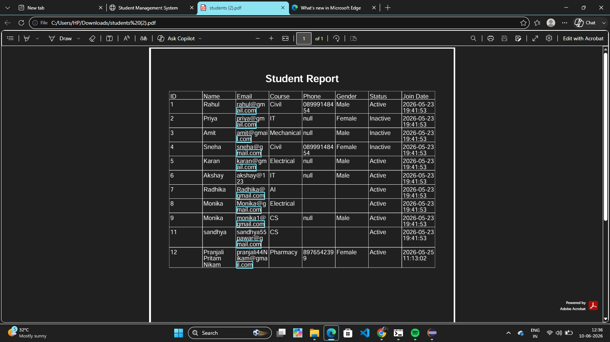

# Student Management System

## Overview

Student Management System is a web-based application developed using Java, JSP, Servlets, JDBC, and MySQL. It helps administrators manage student records efficiently through a user-friendly interface.

## Features

* Secure Admin Login and Logout
* Add New Students
* Update Student Information
* Delete Student Records
* View Student Profile Details
* Upload Student Photos
* Search Students
* Pagination for Student Records
* Dashboard Statistics
* PDF Report Generation
* Session-Based Authentication

## Technologies Used

### Backend

* Java
* JSP
* Servlets
* JDBC

### Database

* MySQL

### Frontend

* HTML
* CSS
* JavaScript

### Server

* Apache Tomcat

### Libraries

* MySQL Connector/J
* iText PDF

## Project Structure

* Login Module
* Student Management Module
* Profile Module
* Dashboard Module
* PDF Export Module

# Screenshots
 
* Login Page

* Dashboard
 
 
* Add Student Page
 
  
* Student Profile Page

* PDF Report
 

## Future Enhancements

* Excel Export
* Attendance Management
* Email Notifications
* Dark Mode
* Role-Based Access Control

## Author

**Sandhya Pawar**

GitHub: https://github.com/sandhya55p
